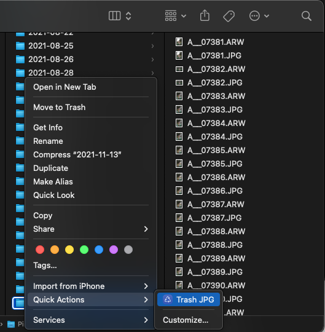
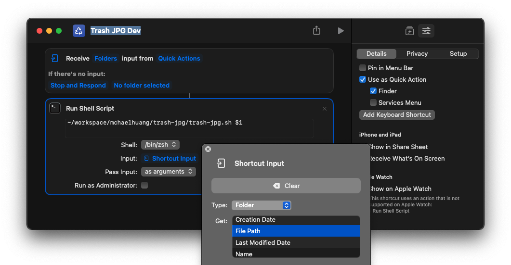
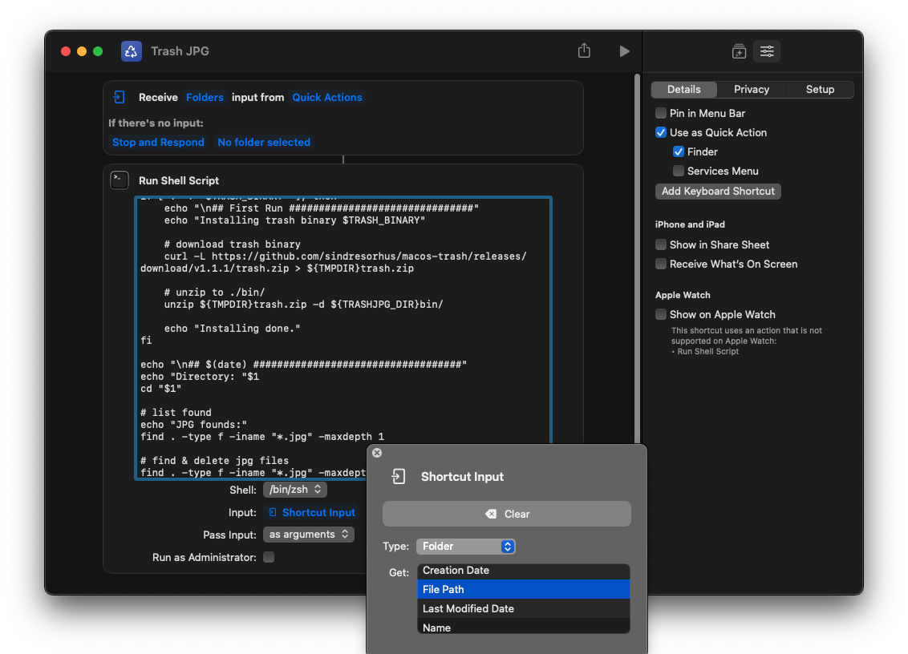

# Trash JPG
Trash all JPGs inside a folder for mac's Quick Action



# Compatibility
MacOS Monterey Shortcuts

## Logs
located on `~/.trash-jpg/trash-jpg.log`

## How to Develop
Call this script instead of copying, and make sure configuration is same with this screenshot
```
~/workspace/mchaelhuang/trash-jpg/trash-jpg.sh $1
```



## How to test
Copy the script into Shortcuts, make sure configuration is same with this screenshot

