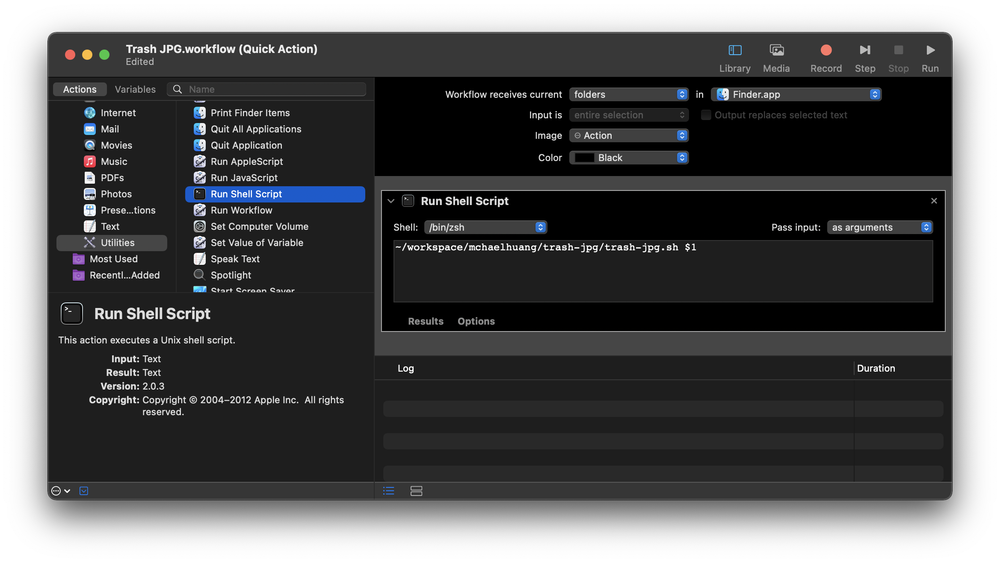

# Trash JPG
Trash all JPGs inside a folder for mac's Quick Action

## Requirements
- homebrew

## How to
1. Install `trash` binary via homebrew, use command `brew install trash-cli` to install
3. Download `trash-jpg.sh` script
4. Add execute permission `chmod +x trash-jpg.sh`
5. Configure Automator
    
6. Trash JPG will show in Quick Action of a folder
    

## Logs
located on `~/trash-jpg.log`